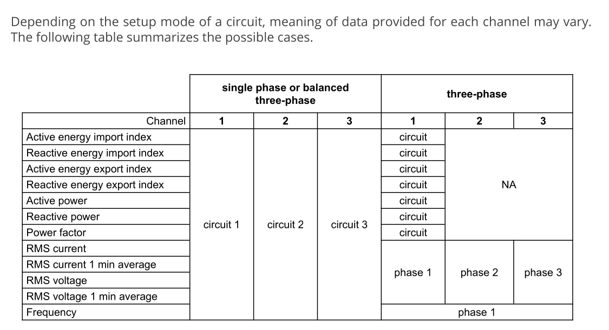

# HACKING

In this notes you can find the reasoning I had to solve this assignment.

## 1) Define and analyze the problem.

In a grasp, I need to develop a service that reads data from a device (Power Elec 6) using Modbus and export it to a cloud server.

Reading the README.md I can see the following strong requirements:

R1) the application shall read the voltage and frequency from the sensor (around 230 V / 50 Hz).

R2) the application shall send the data from the sensor to a server periodically.

R3) the application shall be installed through ssh & scp.

R4) the application shall be compatible with python 3.7.3

Based on those requirements I did some early design decisions:

R1 -> D1.1) the application shall read **only** the following values from the sensor: software version, modbus table version, MAC address voltage and the tuple (circuit configuration, voltage, frequency) of each circuit of each sensor.

Rationale:
* When data is exported to a server, is mandatory to have an ID for the device, which in this case is the MAC address.
* Also, is important to know the current version of the device (both software and the modbus table), to interpret it correctly.
* The value of the frequency's data register should be intrepreted taken into account the configuration of the circuit (if it is single phase/balanced three-phase OR three-phase). For that reason we need to include the circuit configuration data as well.




R1 -> D1.2) the application shall decode the data circuit information data and separate it by connector/channel.

Rationale: Usually, when we work on IoT, the data from the sensors is pre-processed a little bit and packaged into an agreed protocol between the backend team and the IoT team.
For that reason I had chosen to not send the raw data of the sensors in the payload of the message.

R2 -> D2.3) the period time between sensor readings should be specified through the CLI of the application.

Rationale: since this time interval was not specified in the requirements I had chosen to make it flexible through the CLI (it is a low effort addition though).

R2 -> D2.4) the application shall send the data to the server using websockets.

Rationale: even though the protocol was not listed as a requirement, it was suggested. For that reason I used this one.

R2 -> D2.5) the application & sever shall communicate using binary payloads.

Rationale: I am thinking the case in which the cloud or this application is handling several data from several devices. In order to reduce traffic and storage I'll use a binary format for the data.
I had chosen protobuf as the protocol to follow (it is a protocol created by Google to serialize and de-serialize binary data). It is quite lightweight and easy to use.

R3 -> D3.1) the application should be pip-installable.

Rationale: If the application is pip-installable we can install it into our bridges/gateways running the following command through ssh: `pip install git+https://github.com/marifante/iot-python-assignment.git@vx.y.z`.
Or we can just clone the repo and run pip there: `git clone git@github.com:marifante/iot-python-assignment.git && cd iot-python-assignment && pip install .`.
Or zip the repository, copy it through scp and then run pip there.

R4 -> D4.1) the application test-environment should use python 3.7.3.

Rationale: this should be obvious, but a lot of times python version mismatches can be headache. For that reason, I took this into account since the beginning.

## 2) Prepare my work environment.

2.1) As the deliverable will be a Python application, I'll start clean from the beginning packaging with pip. This will make the delivery process easier. Here I'll create a `setup.py` to install it as a library and to install a CLI to use it.
The application will be called `exporter_ecoadapt` and will be located in `src/exporter_ecoadapt`.

```bash
src/
├── exporter_ecoadapt
│   ├── cli.py
│   ├── cloud_client.py
│   ├── exported_data.py
│   ├── exporter_ecoadapt.py
│   ├── generated
│   │   ├── __init__.py
│   │   ├── power_elec6_message_pb2.py
│   │   └─── power_elec6_message.proto
│   ├── __init__.py
│   ├── modbus_client.py
│   └── registers.py
setup.py
```

2.2) Create a docker image with python 3.7.3 and install the application inside it. This will allow the testing with the target python version without struggling with multiple python versions in my local host.
The dockerfile for our application will be in: `docker/Dockerfile.exporter_ecoadapter`.
Alongside with this, create a simple bash script to enter in a shell inside this container. That is located in `scripts/dockershell.sh`.


## 3) How to test it?

3.1) First of all, we need to make unit-tests for our python application. This can be easily done with pytest.

3.2) In order to make an integration test for this application, I'll create a "fake" Power Elec 6 using python. Since Power Elec 6 uses ModBus over TCP, we can create a fake ModBus server that holds hardcoded data and communicate our application with this modbus server.

This integration test will be executed using docker compose. I'll run 3 services there, which will communicate over the internal docker compose network.
Those services are:
* one mocking the cloud server (`dev/server.py`, `docker/Dockerfile.cloud_server`)
* another one faking the Eco Adapt Power Elec (`dev/power_elec_fake.py`, `docker/Dockerfile.power_elec_fake`)
* and our application (`src/exporter_ecoadapt`, `docker/Dockerfile.exporter_ecoadapt`)

To run the integration test we shall only run: `docker-compose up --build` (or `make integration_tests`) from the root of the repository.

## 4) Application layout.

So, the application needs to do 3 things:
* Read data from modbus (implement a modbus client)
* Format the data in binary using protobuf.
* Send the data to a cloud server using websockets (implement a websockets client).

This seems to be the case for a concurrent/parallel programming thing.
Naturally, this is a I/O-bound application, since we will be reading from one place (modbus device) and sending that data to other place (cloud server using websockets).
Also, between each "read" to the modbus device we will wait some time, so the thread running this application will have some idle time. This seems to be a good use case for asyncio.

So, I'll create a simple application that runs 2 tasks in an asyncio loop:
* One task that will read through modbus the data of the device and will put it in a queue. This is located in `src/exporter_ecoadapt/modbus_client.py`
* The other task that will read the data from the queue and send it to the websocket. This is located in `src/exporter_ecoadapt/cloud_client.py`

Also, I created some util modules to:
* decode the data from the sensor: `src/exporter_ecoadapt/registers.py`
* format the data registers from the sensor into a protobuf binary: `src/exporter_ecoadapt/exported_data.py`


## 5) TODO list:

* Compile protobuf schema at the moment of pip installation (to not forget to include compiling the schema in deliveries, manual action = error prone).
* Add bad weather scenarios to cloud_client.py (I only added good_weather scenarios because mocking the behavior to raise an exception from an async context manager was not so straightforward).
* If the idea is to evolve this in a real product, we need to polish the tests and also run it in CI. A small GitHub actions workflow can make the trick to run unit-tests and the integration test.
* The verification part of the integration test can be automated saving the logs of docker compose and then comparing them with a expected list of logs.
